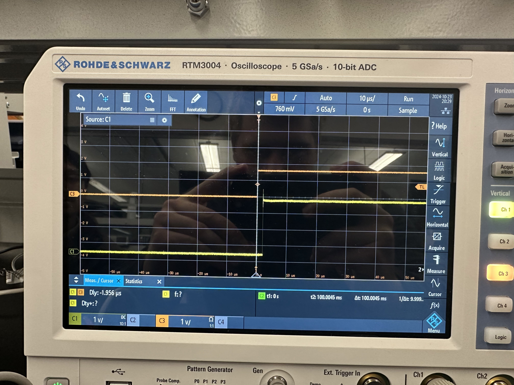

# Measuring 

# Sleep.c 
measured a 36 ms drift over a 1 hour period

Adding a loop that simply runs 1000 times has increased the drift to be 1728 ms slower than ideal.

# timer.c
measured a 6.12 ms drift over a 1 hour period.

Adding a loop did not change the drift.

# delay.c
measured a 6.12 ms drift over a 1 hour period.

# GPIO
This first measurement is from the gpio solution without a message queue or busy loop. We had a delay of 1.95 us. 

After implementing a busy loop we encountered a delay of 4.6 us.
